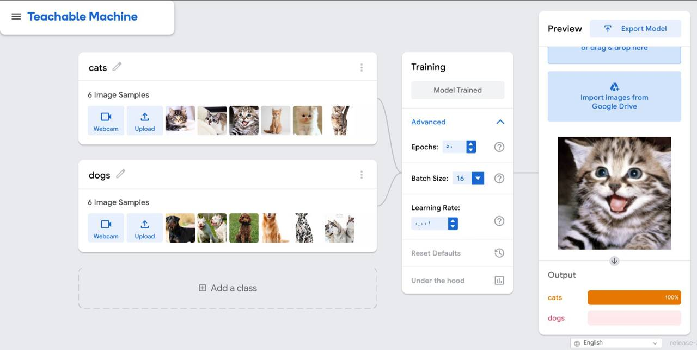
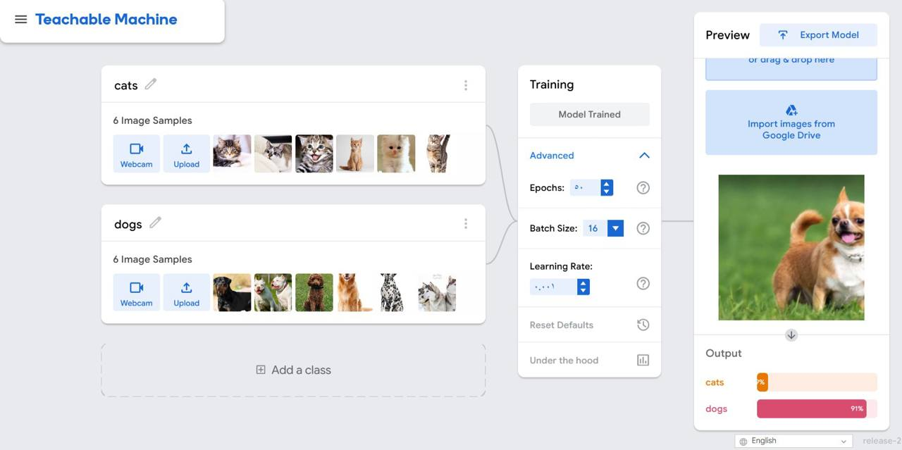
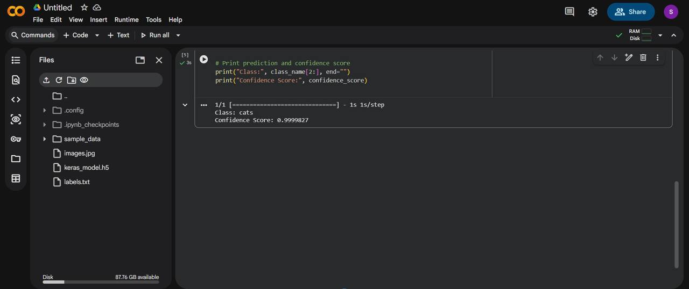

#  Cats vs Dogs Image Recognition🐱🐶

An image recognition project developed using **Google Teachable Machine**, **TensorFlow Keras**, and **Python**. The model classifies images as either a **Cat** or a **Dog** and returns the prediction with a confidence score.

---

## 📖 Project Overview

This project demonstrates how to build an image classification model using **Google Teachable Machine** without manually training a deep learning model in code. The trained model was exported as a **TensorFlow Keras** model and integrated into a Python script to classify new images.

---

## 🛠️ Technologies Used

- Google Teachable Machine
- TensorFlow / Keras
- Python
- NumPy
- Pillow (PIL)
- Google Colab

---

## 📸 Project Results

### 🐱 Cat Prediction

The model successfully classified a cat image with a high confidence score.



---

### 🐶 Dog Prediction

The model successfully classified a dog image with a high confidence score.



---

### 💻 Python Prediction Output

The trained model was loaded into Python and successfully predicted the input image.



---

## ▶️ How to Run

1. Install the required libraries.

```bash
pip install tensorflow pillow numpy
```

2. Place the image you want to classify in the project folder.

3. Update the image path inside `Teachable_Machine_Classifier.py`.

4. Run the Python script.

```bash
python Teachable_Machine_Classifier.py
```

---

## 📌 Features

- Image classification using Google Teachable Machine.
- TensorFlow Keras model integration.
- Python-based prediction.
- Confidence score for each prediction.
- Simple and easy-to-use workflow.

---

## 👩‍💻 Author

**Sama Alzahrani**
